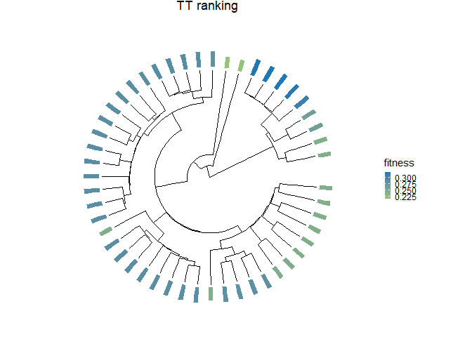

# Intro

LeafRank is a computational framework to infer the fitness ranking of a
single-cell phylogenetic tree.

# Installation

In R environment, make sure the following dependencies are installed:

``` r
library(ape)
library(tibble)
library(ggtree)
library(ggplot2)
library(ggtreeExtra)
library(R.matlab)
```

then

``` r
library(devtools)
install_github("SunPathLab/LeafRank")
```

# Getting Started

We provide an illustaration pipeline of LeafRank:

Specifically, the pipeline includes: 1. Initialize with an **ultrametric
phylogenetic tree**, where branch lengths represent the elapsed time
between nodes. For distance-matrix–based trees, in which branch lengths
reflect mutational distances, we provide an optional step
(`get_ultrametric_prepared`, `get_ultrametric`) to transform them into
an ultrametric tree. 2. Initialize the parameters. We provide both
preset parameters for example tree and function `get_full_pars` to
generate full parameter sets. 3. Call `LearRank`. 4. Visualization

## Initialization

``` r
####### Loading LeafRank ###################
library(LeafRank)

####### Register the parallel cluster #################
library(doParallel)
library(foreach)
cn <- parallel::detectCores()  
cl <- parallel::makeCluster(10)        
registerDoParallel(cl)
acc_parallel <- TRUE  # configuration whether accelerating using parallel computing.
```

## 1. Initialize the tree

``` r
tree_file <- "Exemplary Trees/Exemplary_Tree_SIM.rds"
phy <- readRDS(tree_file)
subsample_size <- 50
idx <- sample(phy$tip.label, subsample_size)
phy <- keep.tip(phy,idx)
```

## 2. Initialize parameters

``` r
################ parameter configuration ########################## 
# Simulation configuration
rho        <- subsample_size/1000000   # sampling probability  
b_rates    <- 0.2*1.2^(0:7)            # birth rates  
d_rates    <- replicate(8, 0.18)       # death rates
nu         <- 0.0001                   # driver mutation rates
time_scale <- 1                        # time scale
# Practical configuration
#rho        <- 0.0005       #0.0005 # sampling probability
#b_rates    <- 1.1*1.1^(0:15)   #comma seperated   16 types (1.1*1.1^0:15) 
#d_rates <- replicate(16, 1)    #comma seperated
#nu <- 0.0001
#param <- get_full_pars(b_rates = b_rates, d_rates = d_rates, nu = nu[1], rho = rho, tree = phy, model = 'default') # model in {'default', 'agressive2', 'agressive4', 'agressive6'}
################  ODE integration setting  ######################
d_t        <- 0.01                     # delta t
timeFrom   <- 0
timeTo     <- ceiling(max(get_depth(phy))/10)*10
timeBy     <- timeTo/200
################  Prepare inputs and outputs ####################
non_negativity_cutoff <- 0
outFile <- "Exemplary Trees/pFitness.out.rds"
rho = as.numeric(rho)
d_t = as.numeric(d_t)
time_scale = as.numeric(time_scale)
nu <- replicate(length(b_rates), as.numeric(nu))
T_vector <- seq(from = as.numeric(timeFrom), to = as.numeric(timeTo), by = as.numeric(timeBy))
non_negativity_cutoff = as.numeric(non_negativity_cutoff)
```

## 3. Call LeafRank

Due to the computational intensity, parallel computing is recommended.
This can be enabled by registering parallel workers and setting
`acc_parallel=TRUE`. For a tree with 250 tips, the approximate runtime
using 20 workers is about 30 minutes.

``` r
outcome = LeafRank(phy, outFile, rho, d_t, time_scale, b_rates, d_rates, nu, T_vector, non_negativity_cutoff, acc_parallel)

stopCluster(cl)
```

## 4. Plot and analyze prediction

``` r
Results       <- readRDS("Exemplary Trees/pFitness.out.rds")
phy           <- Results$phylo
PredFitness   <- Results$meanFitness[1:length(phy$tip.label)]


Pred_ring <- tibble(
  label = phy$tip.label,
  fitness = PredFitness
)
  
plot_Pred <- ggtree(phy, layout = 'circular', linewidth = 0.3) + 
             labs(title = paste0("TT ranking ")) +
             theme(
               legend.position = "right",
               plot.title = element_text(hjust = 0.5),
               legend.key.size = unit(0.2, "cm"),
               plot.margin = unit(c(0,0,0,0), "cm")
               ) + 
             geom_fruit(
               data = Pred_ring,
               geom = geom_bar,
               mapping = aes(y = label, x = fitness, fill = fitness),
               orientation = "y",
               stat = "identity",
               width = 0.3
               ) +
             scale_fill_gradient(
               low = "#93C477", 
               high = "#1F78B4"
               ) +
             guides(
               fill = guide_colorbar(order = 1), 
               color = guide_legend(order = 2)
               )
  
plot_Pred
```

<!-- -->

## Optional: Reconstructing ultrametric tree from Distance-matrix based tree (NJ/MEDICC2).

To construct an ultrametric phylogenetic tree, first convert the
distance-matrix–based tree (Tree-DM) into MATLAB-compatible input using
`get_ultrametric_prepared`. Then run the MATLAB script with `fmincon`
(Optimization Toolbox). Finally, feed the MATLAB output into
`get_ultrametric` to obtain the ultrametric tree.

``` r
# Prepared the MATLAB files for optimization
phy <- readRDS('Exemplary Trees/Tree-DM.rds')
tips_WGD <- phy$node_wgd
get_ultrametric_prepared(phy, tips_WGD, MAT_path = "MATLAB/DM-tree.mat")
```

    ## [1] "Ultrametric tree Step 1 is successfully stored at <MATLAB/DM-tree.mat>. Please use MATLAB script in directory MATLAB to proceed."

``` r
# Access the MATLAB results and output the WGD tree
WGD_tree <- get_ultrametric(phy, MAT_path = "MATLAB/ultra-tree.csv", phy_path = "Exemplary Trees/Tree-WGD.rds")
```

    ## [1] "Ultrametric tree Step 2 is successfully stored at <Exemplary Trees/Tree-WGD.rds>."
